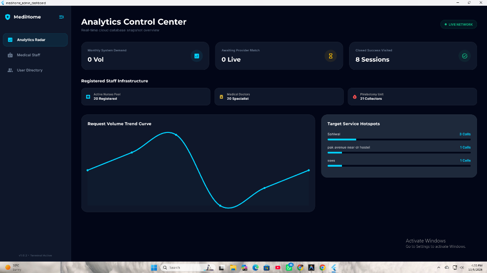
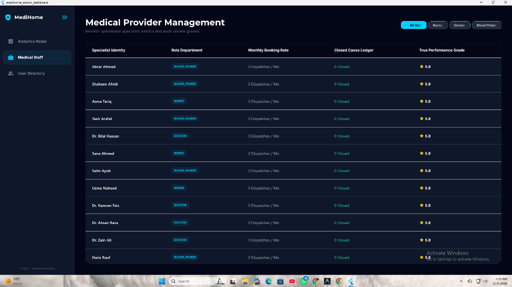
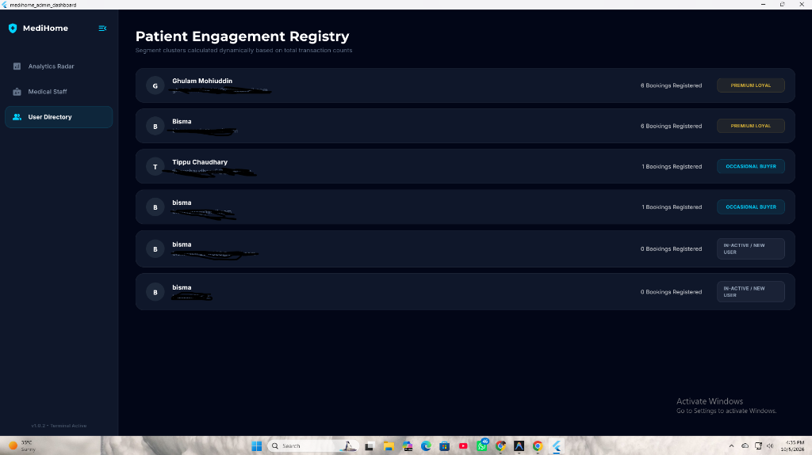

<div align="center">

# 🏥 MediHome Admin Dashboard

### *Next-Gen Real-Time Healthcare Operations & Clinical Analytics Control Center*

[](https://flutter.dev)
[](https://dart.dev)
[](https://supabase.com)
[](https://microsoft.com/windows)
[](LICENSE)

<br/>

**MediHome Admin Dashboard** is a high-performance, enterprise-grade desktop & multi-platform control center engineered for telehealth services, on-demand home medical dispatches, clinical fleet orchestration, and intelligent patient engagement clustering.

[Explore Features](#-key-features) • [Screenshots](#-interface-showcase) • [Tech Stack](#-technology-stack) • [Getting Started](#-getting-started) • [Database Architecture](#-database-views--schema)

</div>

---

## 📸 Interface Showcase

### 1. Analytics Control Center (Radar)
> Real-time cloud database snapshot overview displaying system demand velocity, dispatch matching queues, specialist pools, dynamic demand trend curves, and regional deployment clusters.



---

### 2. Medical Provider Management
> Centralized registry monitoring operational specialist metrics, categorized dispatches, closed case ledgers, role departments (Doctors, Nurses, Phlebotomists), and verified performance ratings.



---

### 3. Patient Engagement Registry
> Comprehensive patient directory with automated engagement segmentation algorithms, categorizing users into *Premium Loyal*, *Occasional Buyer*, and *In-active* cohorts.



---

## ✨ Key Features

### 📊 Real-Time Operations Radar
- **Live Cloud Network Status**: Continuous telemetry synchronization via Supabase real-time client.
- **Key Performance Indicators (KPIs)**: Instant readouts for Monthly System Demand, Awaiting Provider Matches, and Successful Closed Visits.
- **Dynamic Trend Visualization**: Smooth cubic Bezier curves powered by `fl_chart` illustrating request volume trajectories and peak surge periods.
- **Geographic Service Hotspots**: Cluster-based workload distribution meters (e.g. Sahiwal Region, medical hostel zones).

### 🩺 Healthcare Provider Fleet Management
- **Role-Based Segmentation**: Dynamic multi-tier filtering across General Practitioners, Specialist Doctors, Home Nurses, and Phlebotomy Mobile Collectors.
- **Operational Metrics Audit**: Live tracking of dispatches per month, completed cases, and performance grades with star indicators.
- **Interactive Data Table**: Responsive horizontal & vertical scrollable data grid tailored for large desktop displays.

### 👥 Intelligent Patient Cohort Clustering
- **Behavioral Segmentation**: Automated tagging of patient cohorts based on clinical utilization patterns:
  - 🥇 **Premium Loyal** — High-frequency care recipients with metallic gold insignia.
  - ⚡ **Occasional Buyer** — Scheduled/periodic appointment holders with electric cyan insignia.
  - 💤 **In-Active / New User** — Newly onboarded profiles pending appointment activation.
- **Instant Patient Directory**: Fast avatar lookup with contact and transaction histories.

### 🎨 Dark Luxe & Glassmorphic UI/UX
- **Palette**: Deep Space Navy (`#020617`), Frosted Slate (`#0F172A`), Electric Teal neon glow (`#00D2FF`), and Luxe Gold accents (`#F59E0B`).
- **Typography**: Precision typography paired with Google Fonts (`Montserrat` and `Inter`).
- **Micro-Interactions**: Collapsible fluid sidebar navigation, smooth hover states, and physics-driven spring animations.

---

## 🛠 Technology Stack

| Layer | Technologies |
|---|---|
| **Framework** | [Flutter](https://flutter.dev) (SDK ^3.12.2) |
| **Language** | [Dart](https://dart.dev) (Null Safety) |
| **Backend & Auth** | [Supabase](https://supabase.com) (`supabase_flutter ^2.16.0`) |
| **Data Visualization**| [fl_chart ^1.2.0](https://pub.dev/packages/fl_chart) |
| **Typography** | [Google Fonts ^8.1.0](https://pub.dev/packages/google_fonts) |
| **Target Platforms** | Windows Desktop (x64 Native C++ Runner), macOS, Linux, Web |

---

## 📁 Repository Structure

```text
medihome_admin_dashboard/
├── lib/
│   ├── main.dart             # Application root & Supabase initialization
│   ├── splash_screen.dart    # Animated brand launch & handshake sequence
│   └── admin_dashboard.dart  # Multi-module dashboard interface & state
├── screenshots/              # High-resolution production UI captures
│   ├── analytics_control_center.png
│   ├── medical_provider_management.png
│   └── patient_engagement_registry.png
├── windows/                  # Native Windows desktop C++/CMake runner
├── pubspec.yaml              # Manifest & dependency declarations
└── analysis_options.yaml     # Dart analysis and linter rules
```

---

## 🚀 Getting Started

### Prerequisites

Ensure the following tools are installed on your workstation:
- [Flutter SDK](https://docs.flutter.dev/get-started/install) (v3.12.0 or higher)
- [Visual Studio 2022](https://visualstudio.microsoft.com/) with **Desktop development with C++** workload enabled (for Windows desktop builds)
- [Git](https://git-scm.com/)

### Installation & Run

1. **Clone the repository:**
   ```bash
   git clone https://github.com/Ghulam-Mohiuddin007/medihome_admin_dashboard.git
   cd medihome_admin_dashboard
   ```

2. **Install Flutter dependencies:**
   ```bash
   flutter pub get
   ```

3. **Verify analyzer health:**
   ```bash
   flutter analyze
   ```

4. **Launch natively on Windows Desktop:**
   ```bash
   flutter run -d windows
   ```

5. **Generate a production Release executable:**
   ```bash
   flutter build windows --release
   ```
   *The standalone binary will be generated under `build/windows/x64/runner/Release/`.*

---

## 🗄 Database Views & Schema

The dashboard connects directly to Supabase SQL views engineered for aggregated operational insights:

- `view_location_analytics`: Aggregates service demand counts by geographical boundaries.
- `view_staff_analytics`: Computes active dispatches, completed visits, and customer feedback grades for registered medical staff.
- `view_user_analytics`: Synthesizes total booking transactions and derives dynamic customer segmentation tags.

Configure your Supabase credentials in [lib/main.dart](file:///d:/medihome_admin_dashboard/lib/main.dart):
```dart
await Supabase.initialize(
  url: 'YOUR_SUPABASE_URL',
  anonKey: 'YOUR_SUPABASE_ANON_KEY',
);
```

---

## 🤝 Contributing

Contributions, issues, and feature requests are welcome!
1. Fork the Project
2. Create your Feature Branch (`git checkout -b feature/AmazingFeature`)
3. Commit your Changes (`git commit -m 'Add some AmazingFeature'`)
4. Push to the Branch (`git push origin feature/AmazingFeature`)
5. Open a Pull Request

---

## 📄 License

Distributed under the MIT License. See `LICENSE` for more information.

<div align="center">
  <sub>Engineered with precision for modern healthcare management. Built with ❤️ using Flutter & Supabase.</sub>
</div>
